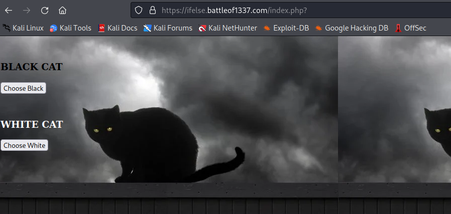

| Name           | Description                                                          |
| -------------- | -------------------------------------------------------------------- |
| Cat-Dalmantion | find the flag in side the cat... dang i can be a poet... wink* wink* |

This is a web challenge that shows an endpoint or file that accept both GET and POST request and shows a different response. Lets begin, we retrieve this page upon accessing the given url.

We have two options to either chose a *Black Cat* or a *White Cat*. This might be one of the tricky question but lets inspect the source. 
![[writeup/bo1337-2022/assets/cat-dalmantion/cat-dalmantion-20220719091227939.png]]

From the above screenshot, we can see that choosing Black Cat will perform a GET request while choosing a White Cat will perform a POST request to index.php. Lets click on both and view in BurpSuite history tab. I found that there is a flag embeded in response header for a GET request.
![[writeup/bo1337-2022/assets/cat-dalmantion/cat-dalmantion-20220719091851348.png]]